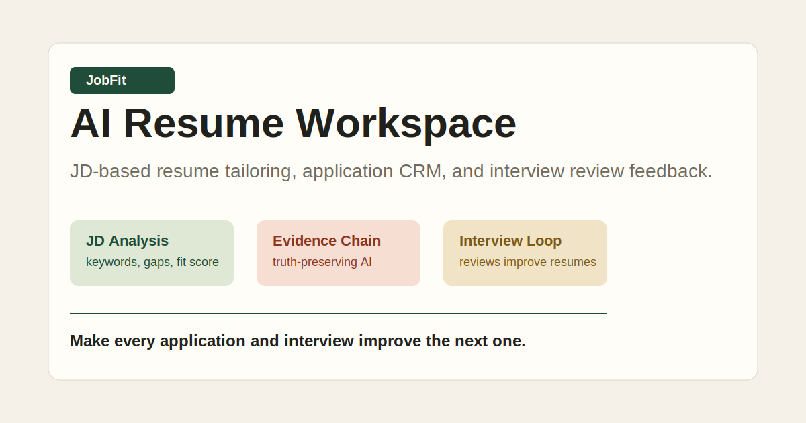

# JobFit Resume AI



AI-powered job application workspace for tailoring resumes to job descriptions, managing applications, and turning interview reviews into reusable career assets.

中文：一个基于岗位 JD 自动适配简历、管理投递记录、沉淀面试复盘的 AI 求职工作台。

## Why This Project

Most resume tools generate a resume once. JobFit Resume AI is designed around a longer job-search loop:

1. Build a structured career profile.
2. Paste a target job description.
3. Analyze the role, company context, gaps, and keywords.
4. Generate a tailored resume with evidence tracking.
5. Export a PDF and save the application record.
6. Review interviews and feed learnings back into the profile.

The goal is not just to write a resume. The goal is to make every application and interview improve the next one.

## Core Features

- **Resume import**: Upload or paste an old resume and convert it into structured profile drafts.
- **JD analysis**: Extract role requirements, keywords, success profile, and gaps.
- **Tailored resume generation**: Generate a resume version based on the target JD.
- **Evidence chain**: Track which resume claims come from which profile evidence.
- **PDF export**: Export the generated resume as a printable PDF.
- **Application CRM**: Track companies, roles, channels, resume versions, and next steps.
- **Interview review**: Record interview questions, weak spots, and improvement actions.
- **Review feedback loop**: Turn interview reviews into profile backlog and resume improvements.
- **Big Tech mode**: ATS-friendly template, company research card, success profile, batch JD analysis, and STAR behavioral interview library.

## What Makes It Different

普通 AI 简历工具通常只做“生成简历”。JobFit 更强调求职闭环：

- **Truth-preserving generation**: AI should not invent companies, projects, dates, or metrics.
- **Evidence-first resume writing**: Important claims need traceable sources.
- **Interview-to-resume feedback**: Interview reviews create new profile tasks and STAR stories.
- **Job-search CRM**: Resume versions and application status are managed together.
- **Big Tech preparation**: ATS resume mode and STAR behavioral preparation are built into the flow.

## Current Status

This repository currently contains a static HTML/CSS/JS product prototype plus product documents.

It is not yet a production application. The next implementation step is to turn this prototype into a real web MVP with:

- Next.js
- Supabase or PostgreSQL
- OpenAI API
- TipTap editor
- Playwright PDF export

## Local Preview

Open this file in a browser:

```text
index.html
```

No build step is required for the current prototype.

## Project Structure

```text
.
├── index.html              # Interactive static prototype
├── styles.css              # UI styles
├── script.js               # Prototype interactions
├── PRD.md                  # Product requirements document
├── PROJECT_PLAN.md         # Roadmap and implementation plan
├── TECH_SPEC.md            # Technical implementation notes
├── AI_PROMPTS.md           # AI prompt and structured output design
├── BIG_TECH_SKILLS.md      # Big Tech resume/interview skill research
└── MODAO_PROTOTYPE.md      # Modao/Figma prototype guide
```

## Roadmap

- [x] Static product prototype
- [x] JD analysis flow
- [x] Resume generation flow
- [x] Evidence chain concept
- [x] Application CRM concept
- [x] Interview review feedback loop
- [x] Big Tech mode concept
- [ ] Real profile CRUD
- [ ] Resume PDF/Word import
- [ ] OpenAI-powered JD parsing
- [ ] Real resume editor
- [ ] Playwright PDF export service
- [ ] User accounts and data persistence
- [ ] Public personal website generation

## Recommended MVP Stack

- Frontend: Next.js, React, Tailwind CSS, shadcn/ui
- Editor: TipTap
- Backend: Next.js API routes or FastAPI
- Database: PostgreSQL / Supabase
- AI: OpenAI API structured outputs
- PDF: Playwright HTML-to-PDF
- Storage: Supabase Storage or Cloudflare R2

## Docs

- [Product Requirements](./PRD.md)
- [Project Plan](./PROJECT_PLAN.md)
- [Technical Spec](./TECH_SPEC.md)
- [AI Prompts](./AI_PROMPTS.md)
- [Big Tech Skills](./BIG_TECH_SKILLS.md)
- [Prototype Guide](./MODAO_PROTOTYPE.md)

## License

License is not selected yet.
